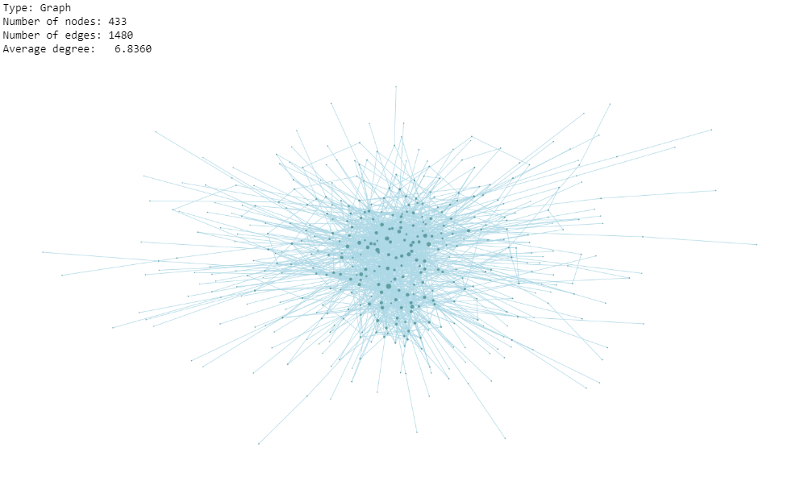

# Network Analysis and Link Prediction with NetworkX

## 🔸 Requirements
 - networkx == 2.8.5
 - pandas
 - sklearn
 - matplotlib

## 🔸 Dataset
PDC World Championship data from 1994-2022 were used.

| index 	| Tournament Year 	|      Stage     	| player_1name 	| player_2name 	| player_1sore 	| player_2score 	|
|:-----:	|:---------------:	|:--------------:	|:------------:	|:------------:	|:------------:	|:-------------:	|
|   0   	|       2022      	|      FINAL     	|   Smith M.   	|   Wright P.  	|       5      	|       7       	|
|   1   	|       2022      	|   SEMI-FINALS  	|   Wright P.  	|  Anderson G. 	|       6      	|       4       	|
|   2   	|       2022      	|   SEMI-FINALS  	|   Smith M.   	|    Wade J.   	|       6      	|       3       	|
|   3   	|       2022      	| QUARTER-FINALS 	|   Price G.   	|   Smith M.   	|       4      	|       5       	|
|   4   	|       2022      	| QUARTER-FINALS 	|   Wright P.  	|    Rydz C.   	|       5      	|       4       	|

## 🔸 Graph
